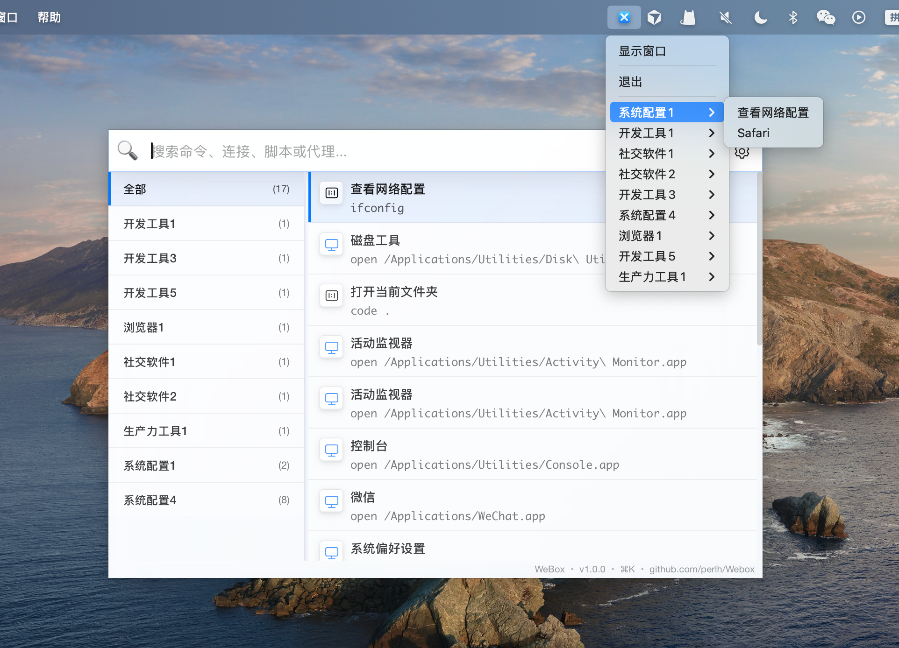

# WeBox — 快捷命令管理工具

WeBox 是一款轻量高效的快捷命令管理工具，同时支持系统托盘与快捷窗口两种交互模式。

- ✅ 双模式运行：同时支持 GUI 快捷命令窗口和系统托盘调用执行命令
- 🔍 快速搜索：Command+K（macOS）一键呼出搜索窗口



## 📦 安装与使用

1. 下载最新版本安装包（目前仅支持 macOS），拖动到/Application 文件夹
2. 安装后，执行以下命令后运行程序

```bash
sudo xattr -d com.apple.quarantine /Applications/Wavely.app
```

3. 按下 Command+K（macOS） 即可呼出快捷搜索窗口
4. 输入命令关键词，回车即可执行！

## ❤️ 支持我们

如果你觉得 WeBox 让你的工作更高效、更轻松，欢迎通过微信赞赏支持我们的持续开发！
每一份鼓励，都是我们前进的动力 🙏

<div align="center">

</div>
